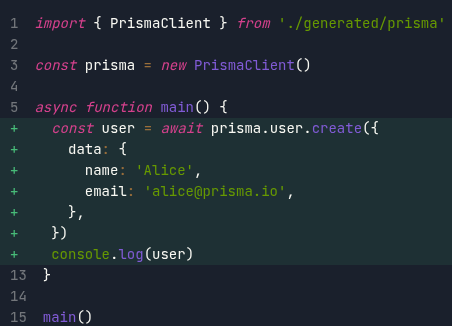

# GETTING STARTED WITH PRISMA
 Prisma is a Node.js and TypeScript ORM with an intuitive data model, automated migrations, type-safety, and auto-completion.

 Prisma ORM makes it easy for developers to reason about their database queries by providing a clean and type-safe API for submitting database queries which returns plain old JavaScript objects.

 To be able to work with prisma you have to ensure you have node installed and the rest is a walk in the park.

 To begin generate the package.json file:

 `$ npm init --y`

 To install the Prisma CLI as a development dependency in your project run :

 `$ npm install prisma --save-dev `

 Then, set up Prisma ORM with the init command of the Prisma CLI:

 `$ npx prisma init --datasource-provider postgresql `

 This creates a new prisma directory with a schema.prisma file and configures postgres as your database. You're now ready to model your data and create your database with some tables.

 You can also note the .env file created which is used for defining the environment variables such as the connection string.

 ## NOTE:

**If you do not specify the data source provider prisma sets it as postgresql as default**

# Model your data in the Prisma schema

Models in the Prisma schema have two main purposes:

* Represent the tables in the underlying database
* Serve as foundation for the generated Prisma Client API

Inside the schema.prisma file ,you can create the database tables 

The models appear in the format:

      model User {
       id    Int     @id @default(autoincrement())
      email String  @unique 
      name  String?
      posts Post[]
       }

 According to what we have created the database will have a table called  User

 What is inside the  {} is what we call fields.

 Fields contain the field name, the field type and attributes which are optional.

 Field types can be of type :

 `String , Int , Boolean , JSON , Decimal , float , Bytes , BigInt`  

 Field attributes as we said are optional 

 Example is @id that we used ealier which makes a field a primary key.

 The rest eg **@unique**,**default** their names explain how they work.

 Other examples of field attributes include 

 `@map ,@@map , @@default ,@@unique`

 # Migrations in prisma

Migrations are a way to manage and apply changes to your database in a controlled and consistent way.

At this point, you have a Prisma schema but no database yet. Run the following command in your terminal to create the  database and the User  table represented by your model:

` $npx prisma migrate dev --name`

This command did three things:

1. It created a new postgresql migration file for this migration in the prisma/migrations directory.
2. It executed the postgresql migration file against the database.
3. It ran prisma generate under the hood (which installed the @prisma/client package and generated a tailored   Prisma Client API based on your models).

# Prisma Client

Now to be able to make queries to your db you need the prisma client.

Lucky for us , when we did the migrations it got installed however, the command to install prisma client is :

` $ npm install @prisma/client`

Now generate  the client with the command :

`npx prisma generate`

The install command invokes prisma generate for you which reads your Prisma schema and generates a version of Prisma Client that is tailored to your models.

## Create a new User record
Let's start with a small query to create a new User record in the database and log the resulting object to the console. 

Now if you execute the javascript file you will have created a new user record

To create many users use the ***createMany()*** function call instead of ***create()*** and create an array of objects.

# NOTE

Remember to run a migration to ensure consistency 

## Retrieve all user records

we use the function call ***findMany()***

## Retrive first user to  pass criteria

We use ***findFirst()*** and the ***where*** and ***select*** key words

## Update table

We use the ***update()*** and specify  where update should happen using where key word.

## Delete user 

We use the ***delete()*** 

To delete alot of records at once we use the ***deleteMany()***

However remember that in real world enterprises we do not delete records permanently but perform a soft 

